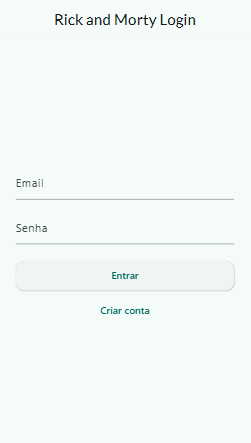
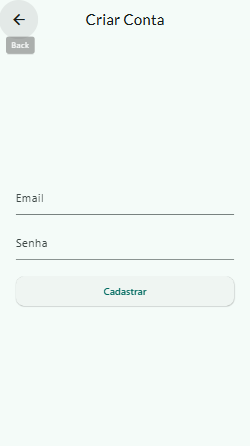
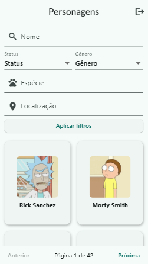
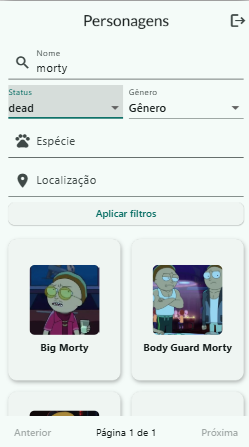

# Rick and Morty App

Uma aplicação Flutter Web que consome a [Rick and Morty API](https://rickandmortyapi.com/) e integra com Firebase Authentication para login, cadastro e logout.

---

## Tecnologias

- **Flutter Web** (desenvolvimento no [FlutLab](https://flutlab.io/))
- **Dart**  
- **Firebase Auth** (email/senha)  
- **HTTP** (requisições REST)  
- **Google Fonts** (tipografia moderna)  
- **Rick and Morty API**  

---

## Funcionalidades

- **Login / Cadastro** com validação de email e senha (mínimo 6 caracteres + `@`)  
- **Proteção de rota**: só acessa a lista de personagens se logado  
- **Listagem paginada** de personagens  
- **Filtros** por nome, status, espécie, gênero e localização  
- **Logout**  

---

## Como usar

1. **Clone o repositório**  
   ```bash
   git clone https://github.com/jp9141joao/mobile-project.git
   cd mobile-project
   ```

2. **Instale as dependências**  
   ```bash
   flutter pub get
   ```

3. **Configure o Firebase**  
   - No console do Firebase, crie um projeto e adicione um app Web.  
   - Copie as credenciais (apiKey, authDomain, etc.) e cole em `lib/main.dart` no bloco `Firebase.initializeApp(options: ...)`.

4. **Execute no navegador**  
   ```bash
   flutter run -d chrome
   ```

---

## Código fonte

- Todo o código Dart está versionado no GitHub  
- Branch principal (`main`) contém a versão estável e funcional

---

## Prints da aplicação
  





---

## Link de deploy

- **Web Preview**: https://preview.flutlab.io/user_cfh/mobile-project/ 


